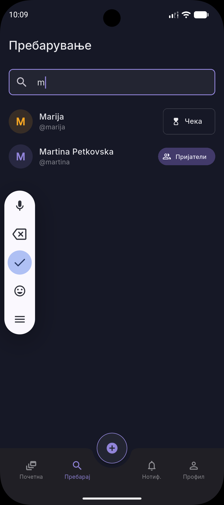
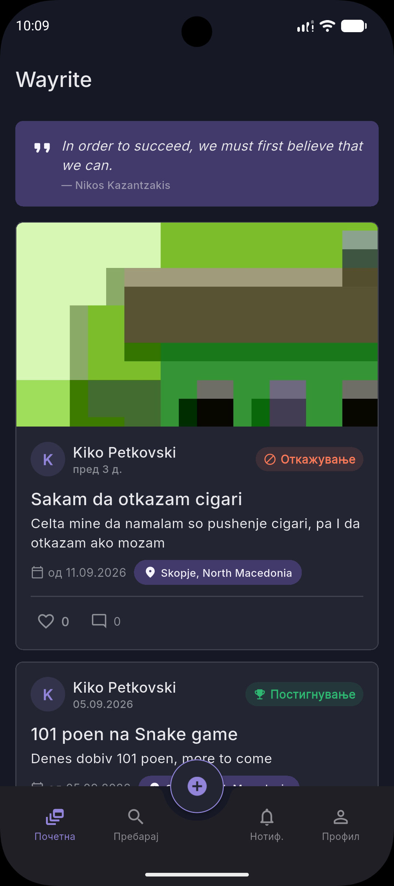
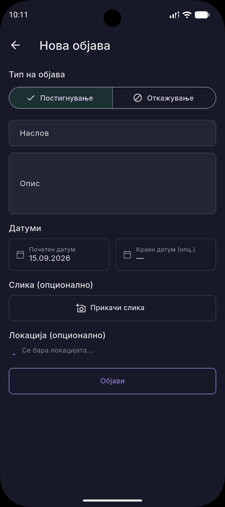
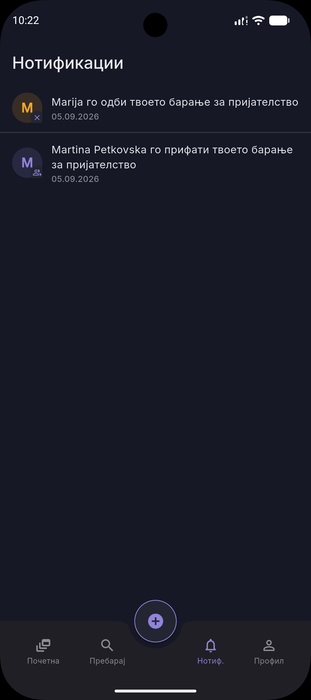
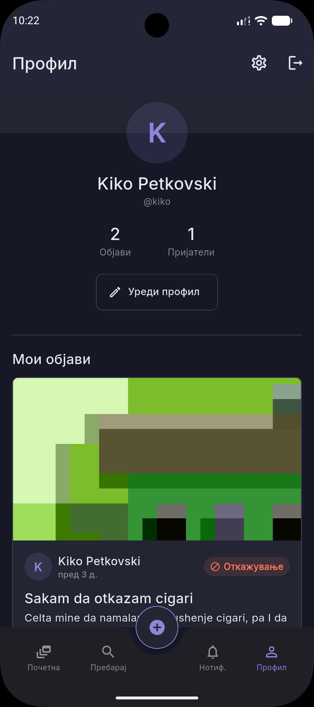
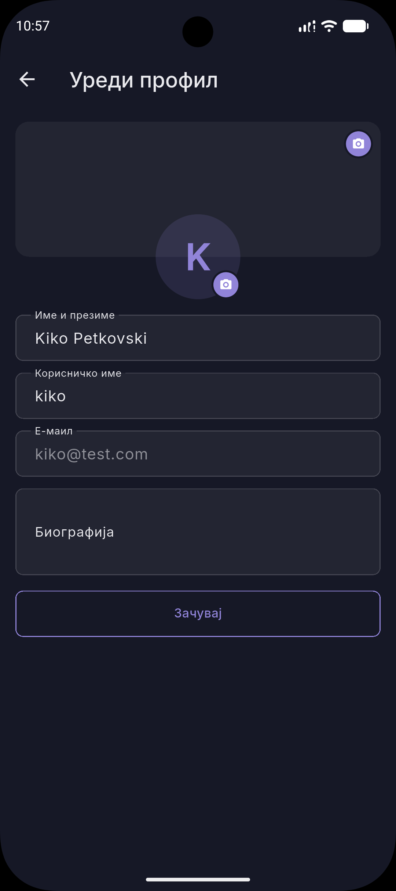

# Wayrite

Flutter апликација за споделување лични постигнувања и откажувања од лоши
навики со пријатели — на социјален принцип (feed, лајкови, коментари,
барања за пријателство, нотификации), со слики од камера/галерија, GPS
локација на објавите, „Цитат на денот" повлечен од јавен web сервис и
целосна локална персистенција на податоците (работи офлајн, без сервер).


---

## Содржина

1. [Опис на апликацијата](#опис-на-апликацијата)
2. [Screenshots / Изгледи од апликацијата](#screenshots--изгледи-од-апликацијата)
3. [Тим](#тим)
4. [Клучни карактеристики](#клучни-карактеристики)
5. [Критериуми за оценување → имплементација](#критериуми-за-оценување--имплементација)
6. [Архитектура и структура на проектот](#архитектура-и-структура-на-проектот)
7. [State management](#state-management)
8. [Екрани и навигација](#екрани-и-навигација)
9. [Дизајн систем](#дизајн-систем)
10. [Tech Stack / Зависности (pubspec.yaml)](#tech-stack--зависности-pubspecyaml)
11. [Web / Location / Camera сервиси](#web--location--camera-сервиси)
12. [Локална персистенција на податоци](#локална-персистенција-на-податоци)
13. [Иновативност](#иновативност)
14. [Барања за стартување (Prerequisites)](#барања-за-стартување-prerequisites)
15. [Стартување на проектот](#стартување-на-проектот)
16. [Тестирање](#тестирање)
17. [Миграција кон Firebase](#миграција-кон-firebase)
18. [Познати ограничувања](#познати-ограничувања)
19. [Troubleshooting / FAQ](#troubleshooting--faq)
20. [Roadmap / Идни планови](#roadmap--идни-планови)
21. [Contributing](#contributing)
22. [Лиценца](#лиценца)
23. [Благодарност](#благодарност)
24. [Целосна документација](#целосна-документација)

---

## Опис на апликацијата

**Wayrite** е социјална мрежа фокусирана исклучиво на лични цели и
мотивација. Корисниците објавуваат:

- **Постигнувања** (пр. „30 дена редовно тренирање"), или
- **Откажувања од лоши навики** (пр. „10 дена без цигари"),

а нивните пријатели реагираат со лајк и коментар, слично на класична
социјална мрежа. Апликацијата поддржува регистрација/најава (со демо
профил за брз преглед), пребарување и додавање пријатели, нотификации за
секоја интеракција, и целосно уредување на кориснички профил (вклучувајќи
профилна слика).

## Screenshots / Изгледи од апликацијата


| Екран | Screenshot |
|---|---|
| Пребарување на пријатели |  |
| Почетна страница (Feed) со „Цитат на денот" |  |
| Креирање нова објава |  |
| Нотификации |  |
| Профил |  |
| Уредување профил |  |

## Клучни карактеристики

| Карактеристика | Кратко објаснување |
|---|---|
| **State management** | `provider` над два одделни `ChangeNotifier` store-а: `MockDataStore` (податоци) и `SettingsStore` (поставки). |
| **Authentication** | Регистрација / најава / одјава + „Продолжи со демо профил". Сесијата се памти локално. |
| **Custom UI** | Сопствен дизајн систем (бои, типографија, spacing, икони) + повторно употребливи компоненти. |
| **Web services** | „Цитат на денот" на Feed екранот, повлечен од јавен HTTP API. |
| **Location services** | Опционално прикачување GPS локација (со reverse-geocoding до читлив назив) кон објава. |
| **Camera services** | Слика за објава и профилна слика, избор помеѓу камера и галерија. |
| **Data handling** | Сите податоци (корисници, објави, коментари, нотификации, поставки) се зачувани локално преку `shared_preferences` и преживуваат рестарт. |
| **Navigation** | Именувани рути (`MaterialApp.routes` + `onGenerateRoute`) + стек навигација + bottom navigation со 4 таба и централно FAB копче. |
| **10 екрани** | Login, Register, Feed, Search, Notifications, Profile, EditProfile, CreatePost, PostDetail, Settings. |

## Критериуми за оценување → имплементација

| # | Критериум | Каде е имплементирано |
|---|---|---|
| 1 | **State management** | [`lib/data/data_store.dart`](lib/data/data_store.dart) (`MockDataStore`) и [`lib/data/settings_store.dart`](lib/data/settings_store.dart) (`SettingsStore`) се два одделни `ChangeNotifier`-и, изложени низ целото widget-стебло преку `MultiProvider` во [`lib/main.dart`](lib/main.dart). Екраните читаат со `context.watch<MockDataStore>()`, менуваат со `context.read<MockDataStore>()`. |
| 2 | **Authentication** | `login()` / `register()` / `logout()` / `loginAsDemoUser()` во `MockDataStore`; UI во [`login_screen.dart`](lib/screens/auth/login_screen.dart) и [`register_screen.dart`](lib/screens/auth/register_screen.dart). Сесијата (`currentUserId`) се персистира локално — при повторно отворање апликацијата автоматски препознава најавен корисник (`main.dart` → `initialRoute`). |
| 3 | **Custom UI elements** | Дизајн систем во [`lib/core/theme/`](lib/core/theme) (бои, типографија, spacing, икони) + повторно употребливи компоненти во [`lib/core/widgets/`](lib/core/widgets): копчиња (`PrimaryButton`/`SecondaryButton`), картичка за објава (`PostCard`), avatar (`UserAvatar`), беџ (`PostTypeBadge`), chip (`LocationChip`), и др. |
| 4 | **Web services** | [`lib/services/quote_service.dart`](lib/services/quote_service.dart) — HTTP GET до јавен API за „Цитат на денот", прикажан на врвот на Feed екранот преку [`QuoteOfDayCard`](lib/core/widgets/quote_of_day_card.dart), со целосно ракување на loading / успех / грешка (плус локален cache за офлајн приказ). |
| 5 | **Location services** | [`lib/services/location_service.dart`](lib/services/location_service.dart) — GPS координати (`geolocator`) + reverse-geocoding до читлив назив на место (`geocoding`). Опционално прикачување кон објава во [`CreatePostScreen`](lib/screens/post/create_post_screen.dart). |
| 6 | **Camera services** | [`lib/services/image_service.dart`](lib/services/image_service.dart) — `image_picker` за слика од камера или галерија, преку заеднички bottom sheet ([`image_source_sheet.dart`](lib/core/widgets/image_source_sheet.dart)). Се користи за слика на објава и за профилна слика. |
| 7 | **Data handling** | [`lib/services/persistence_service.dart`](lib/services/persistence_service.dart) — целата состојба се сериjализира во JSON (`toJson`/`fromJson` на секој модел) и се чува преку `shared_preferences`; се вчитува при стартување (`hydrate()`) и се зачувува по секоја промена. |
| 8 | **Navigation** | Именувани рути за сите екрани (`static const routeName` на секој екран, регистрирани во `MaterialApp.routes`/`onGenerateRoute` во `main.dart`), стек навигација (`Navigator.pushNamed`/`pop`), и bottom navigation со 4 таба + централно FAB копче ([`HomeShell`](lib/screens/home/home_shell.dart)). |
| 9 | **> 7 екрани** | 10 екрани вкупно — целосен список подолу. |
| 10 | **Innovation aspect** | Комбинација од: (1) мотивациски цитат од web сервис, (2) GPS „check-in" при објава, (3) целосно офлајн-функционална апликација со локална база, спремна за директна миграција кон Firebase без промена на UI-от. |
| 11 | **Documentation** | Овој README + [`docs/`](docs) папка — детален граф на навигација, дизајн систем, чекори за Firebase, и мапа критериум → код. |


## Архитектура и структура на проектот

```
lib/
  core/
    theme/          — дизајн систем: app_colors, app_typography, app_spacing, app_icons, app_theme
    widgets/        — повторно употребливи UI компоненти (копчиња, PostCard, UserAvatar,
                       LikeButton, PostTypeBadge, LocationChip, QuoteOfDayCard, NotificationTile, ...)
    utils/          — помошни функции (формат на датум, кросплатформско вчитување слики)
  models/           — AppUser, Post, Comment, NotificationItem, RelationshipStatus (со JSON сериjализација)
  data/
    data_store.dart      — MockDataStore (ChangeNotifier): корисници, објави, коментари,
                            нотификации, пријателства, сесија
    settings_store.dart  — SettingsStore (ChangeNotifier): апликациски поставки
    app_store.dart        — единствени (singleton) инстанци на двата store-а
  services/
    quote_service.dart        — web services: „Цитат на денот"
    location_service.dart     — location services: GPS + reverse-geocoding
    image_service.dart        — camera services: избор слика (камера/галерија)
    persistence_service.dart  — data handling: shared_preferences читање/пишување
  screens/
    auth/           — LoginScreen, RegisterScreen
    home/           — HomeShell (bottom navigation + FAB, хостира 4 таба)
    feed/           — FeedScreen (хронолошки feed + „Цитат на денот")
    post/           — CreatePostScreen, PostDetailScreen
    search/         — SearchScreen (пребарување + пријателства)
    profile/        — ProfileScreen, EditProfileScreen
    notifications/  — NotificationsScreen
    settings/       — SettingsScreen
  main.dart         — MultiProvider setup, hydration, именувани рути
```

## State management

Целата состојба на апликацијата тече низ **два** одделни `ChangeNotifier`
сервиси, изложени во целото widget-стебло преку `MultiProvider`:

- **`MockDataStore`** (`lib/data/data_store.dart`) — корисници, објави,
  коментари, нотификации, пријателства и тековна сесија. Автоматски се
  персистира по секоја промена (`_persist()`) и се вчитува пред `runApp`
  (`hydrate()`).
- **`SettingsStore`** (`lib/data/settings_store.dart`) — апликациски
  поставки (пр. „автоматски прикачувај локација"), исто така персистирани
  локално.

Состојбата е намерно поделена по домен (податоци vs. поставки) наместо во
еден „God object". Екраните читаат состојба со `context.watch<T>()`
(за да се прередактираат автоматски при промена) и ја менуваат со
`context.read<T>()`.

## Екрани и навигација

### Список на екрани (10)

| # | Екран | Патека 
|---|---|---|---|
| 1 | Најава (Login) | `lib/screens/auth/login_screen.dart` |
| 2 | Регистрација (Register) | `lib/screens/auth/register_screen.dart` 
| 3 | Почетна страница (Feed) | `lib/screens/feed/feed_screen.dart` |
| 4 | Пребарување (Search) | `lib/screens/search/search_screen.dart`|
| 5 | Нотификации (Notifications) | `lib/screens/notifications/notifications_screen.dart` |
| 6 | Профил (Profile) | `lib/screens/profile/profile_screen.dart` | 
| 7 | Уредување профил (EditProfile) | `lib/screens/profile/edit_profile_screen.dart` |
| 8 | Креирање објава (CreatePost) | `lib/screens/post/create_post_screen.dart` |
| 9 | Детали за објава (PostDetail) | `lib/screens/post/post_detail_screen.dart`  |
| 10 | Поставки (Settings) | `lib/screens/settings/settings_screen.dart`|

`HomeShell` (`lib/screens/home/home_shell.dart`) не се брои како посебен
екран — тој е само контејнер (bottom navigation + FAB) кој хостира 4 од
екраните погоре (Feed / Search / Notifications / Profile) во `IndexedStack`.

### Навигациски граф

```
┌─────────────┐   регистрирај се   ┌──────────────────┐
│ LoginScreen  ├────────────────────▶ RegisterScreen   │
└──────┬───────┘                    └────────┬─────────┘
       │ најава / демо профил                │ успешна регистрација
       ▼                                      ▼
┌──────────────────────────────────────────────────────────────────┐
│                            HomeShell                              │
│              (bottom navigation, 4 таба + FAB "+")                │
│  ┌──────────┐  ┌────────────┐  ┌─────────────────┐  ┌─────────┐  │
│  │FeedScreen│  │SearchScreen│  │NotificationsScr. │  │ Profile │  │
│  └────┬─────┘  └─────┬──────┘  └────────┬─────────┘  └────┬────┘  │
└───────┼──────────────┼──────────────────┼─────────────────┼───────┘
        │ тап на пост   │ резултати/барања  │ тап на ставка    │ Уреди / Одјави / Поставки
        ▼               │                  │                  ▼
┌───────────────────┐   │                  │           ┌──────────────────┐
│ PostDetailScreen   │◀──┼──────────────────┘           │ EditProfileScreen │
└────────────────────┘   │  (like/comment нотиф.)       └──────────────────┘
                          │
                          │ friendRequest/friendAccept нотиф.
                          ▼
                    (враќа на SearchScreen)

FAB "+" во HomeShell ─────▶ CreatePostScreen ── „Објави" ──▶ назад на FeedScreen
Profile ─────▶ SettingsScreen (поставки + бришење локални податоци)
```

Навигацијата комбинира **именувани рути** (секој екран дефинира
`static const routeName`, регистрирани во `MaterialApp.routes` /
`onGenerateRoute` во `lib/main.dart` за екраните со параметри, пр.
`PostDetailScreen(postId: ...)`), **стек навигација** (`Navigator.pushNamed`
/ `pop`), и **bottom navigation со 4 таба + централно FAB копче** за
креирање нова објава.

Целосен опис на секое сценарио (регистрација, пребарување пријатели,
креирање објава, нотификации...): [`docs/UI_FLOW.md`](docs/UI_FLOW.md).

## Дизајн систем

Апликацијата користи еден единствен, темен („Nocturne") визуелен систем,
дефиниран во `lib/core/theme/`:

- **Бои** (`app_colors.dart`) — брендирана виолетова примарна боја,
  посебни бои за типовите објави (`achievement` зелена, `quit` портокалова),
  темна позадина/површина, семантички бои (error/success/warning/like).
- **Типографија** (`app_typography.dart`) — `GoogleFonts.inter`, скала од
  `displaySmall` до `caption`.
- **Spacing** (`app_spacing.dart`) — 4pt grid (`xs=4` до `xxl=32`) +
  радиуси (`radiusSm` до `radiusPill`).
- **Икони** (`app_icons.dart`) — именувани константи над Material Icons.
- **Повторно употребливи компоненти** (`lib/core/widgets/`) —
  `PrimaryButton`/`SecondaryButton`, `AppTextField`, `PostCard`,
  `UserAvatar`, `PostTypeBadge`, `LikeButton`, `LocationChip`,
  `QuoteOfDayCard`, `NotificationTile`, `CommentTile`, `UserListTile`,
  `EmptyState`, `image_source_sheet`.

Целосна референца со сите токени и компоненти: [`docs/DESIGN_SYSTEM.md`](docs/DESIGN_SYSTEM.md).

## Tech Stack / Зависности (pubspec.yaml)

| Пакет | Верзија | Категорија | Улога во проектот |
|---|---|---|---|
| `flutter` | SDK `^3.9.2` | Framework | Основа на апликацијата |
| `cupertino_icons` | `^1.0.8` | UI | iOS-стил икони |
| `provider` | `^6.1.2` | **State management** | `MockDataStore` / `SettingsStore` изложени низ widget-стеблото |
| `http` | `^1.2.2` | **Web services** | HTTP повик за „Цитат на денот" |
| `geolocator` | `^13.0.1` | **Location services** | Читање на тековна GPS локација |
| `geocoding` | `^3.0.0` | **Location services** | Reverse-geocoding до читлив назив на место |
| `image_picker` | `^1.1.2` | **Camera services** | Слика од камера или галерија |
| `shared_preferences` | `^2.3.3` | **Data handling** | Локална персистенција на целата состојба |
| `google_fonts` | `^8.2.1` | UI | Fonт „Inter" за типографијата |
| `firebase_core` | `^4.14.0` | Backend (миграција) | Иницијализација на Firebase |
| `firebase_auth` | `^6.6.1` | Backend (миграција) | Firebase Authentication (по миграција) |
| `cloud_firestore` | `^6.9.0` | Backend (миграција) | Firestore база (по миграција) |
| `firebase_storage` | `^13.5.0` | Backend (миграција) | Складирање слики во облак (по миграција) |
| `flutter_test` | SDK | Dev | Unit / widget тестови |
| `flutter_lints` | `^5.0.0` | Dev | Lint правила за квалитет на код |

> ℹ️ Firebase пакетите (`firebase_core`, `firebase_auth`, `cloud_firestore`,
> `firebase_storage`) се веќе додадени во `pubspec.yaml` подготвени за
> [миграцијата кон Firebase](#миграција-кон-firebase), но апликацијата
> моментално работи целосно локално преку `MockDataStore` /
> `shared_preferences`.

## Web / Location / Camera сервиси

| Сервис | Пакет | Што прави |
|---|---|---|
| **Web (Quote of the Day)** | `http` | GET до јавен цитат-API при отворање на Feed екранот; резултатот се кешира локално (`shared_preferences`) за офлајн приказ ако мрежата подоцна не е достапна. |
| **Location** | `geolocator`, `geocoding` | Ја чита тековната GPS локација на корисникот и ја претвора (reverse-geocoding) во читлив назив на место (пр. „Скопје, Северна Македонија"), опционално прикачен кон нова објава. |
| **Camera** | `image_picker` | Отвора избор помеѓу камера и галерија (заеднички bottom sheet) за слика на објава или нова профилна слика. |

## Локална персистенција на податоци

Целата апликациска состојба — корисници, објави, коментари, нотификации,
пријателства, сесија и поставки — се сериjализира во JSON (секој модел има
`toJson`/`fromJson`) и се зачувува локално преку `shared_preferences`
([`persistence_service.dart`](lib/services/persistence_service.dart)):

- При стартување, `main.dart` чека `appStore.hydrate()` и
  `settingsStore.load()` пред `runApp`, за апликацијата да продолжи точно
  од каде што била оставена.
- По секоја промена (нова објава, лајк, коментар, барање за пријателство,
  промена на поставка...) состојбата автоматски се презачувува.
- `SettingsScreen` нуди контролирано бришење на сите локални податоци (со
  потврда), кое ги враќа demo почетните вредности.

Податоците **преживуваат целосно затворање и повторно отворање** на
апликацијата, без потреба од сервер.

## Барања за стартување (Prerequisites)

Пред да го стартуваш проектот, потребно е да имаш инсталирано:

- **Flutter SDK** `^3.9.2` или понова верзија ([инструкции за инсталација](https://docs.flutter.dev/get-started/install))
- **Dart SDK** (се инсталира заедно со Flutter)
- Уред или емулатор:
  - Android емулатор (Android Studio) **или** физичен Android уред, **или**
  - iOS симулатор (Xcode, само на macOS) **или** физичен iOS уред
- За тестирање на **Location** и **Camera** функциите — препорачано е
  физички уред (емулаторите бараат рачно поставена мок-локација/камера)
- Активна интернет конекција при прв старт (за „Цитат на денот"; апликацијата
  потоа работи и офлајн благодарение на локалниот кеш)

Проверка дали Flutter е правилно инсталиран:

```bash
flutter doctor
```

## Стартување на проектот

```bash
git clone <URL на овој репозиториум>
cd timski
flutter pub get
flutter run
```

На Login екранот, копчето **„Продолжи со демо профил"** најавува со
претходно подготвени demo податоци (корисници, објави, коментари,
нотификации) за брз преглед на целиот UI flow без рачна регистрација.

Локациските и камера функциите бараат физички уред/емулатор со поставена
GPS локација и камера; на десктоп/web fallback е рачен избор на слика од
фајл систем преку галеријата.


## Миграција кон Firebase

Апликацијата моментално работи со локален „backend" (`MockDataStore`), но
е намерно дизајнирана за директна замена со Firebase без промена на UI
кодот — сите екрани комуницираат исклучиво преку јавниот интерфејс на
`MockDataStore` (`login`, `createPost`, `toggleLike`, `addComment`,
`sendFriendRequest`, ...), кој останува идентичен и по миграцијата.

Препорачан редослед: **Firebase Authentication** → **Firestore**
(users/posts/comments/likes) → **Firestore** (friendRequests/friendships)
→ **Cloud Functions** (нотификации) → **Cloud Messaging** (push
нотификации).

Целосни чекор-по-чекор инструкции (вклучувајќи Firestore шема, security
rules и пример Cloud Function): [`docs/FIREBASE_SETUP.md`](docs/FIREBASE_SETUP.md).

## Познати ограничувања

- **Web target и слики**: `dart:io`/`Image.file` не работат на Flutter Web,
  па таму сликите (пост/avatar) се рендерираат преку `NetworkImage` со
  `blob:` URL од `image_picker`. Тоа работи во тековната сесија, но `blob:`
  URL-от не преживува refresh на страницата — на web, прикачените слики не
  се задржуваат по reload (за разлика од Android/iOS, каде вистинска
  патека на диск се користи и трајно се персистира).
- **Цитат на денот API**: оригиналниот `api.quotable.io` престана да
  работи (истечен TLS сертификат), па сервисот користи активно одржувана
  замена (`api.quotable.kurokeita.dev`) со иста намена и тематика.

  
## Contributing

Овој проект е изработен како тимски проект во рамки на предметот
**Тимски проект**.


## Целосна документација

- [`docs/UI_FLOW.md`](docs/UI_FLOW.md) — граф на навигација низ сите екрани
- [`docs/DESIGN_SYSTEM.md`](docs/DESIGN_SYSTEM.md) — бои, типографија, spacing, икони, компоненти
- [`docs/FIREBASE_SETUP.md`](docs/FIREBASE_SETUP.md) — чекор-по-чекор поврзување со Firebase Authentication, Firestore, Cloud Functions и Cloud Messaging
